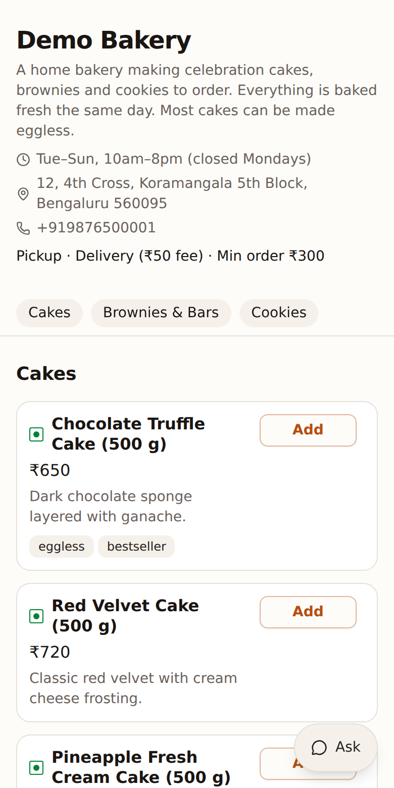
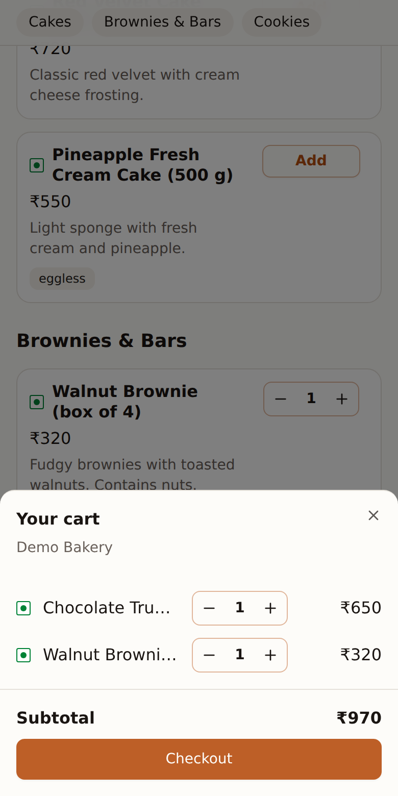
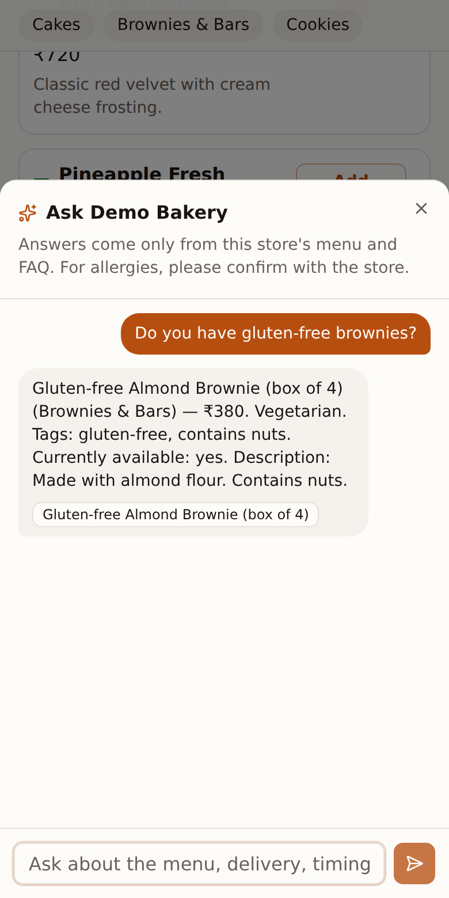
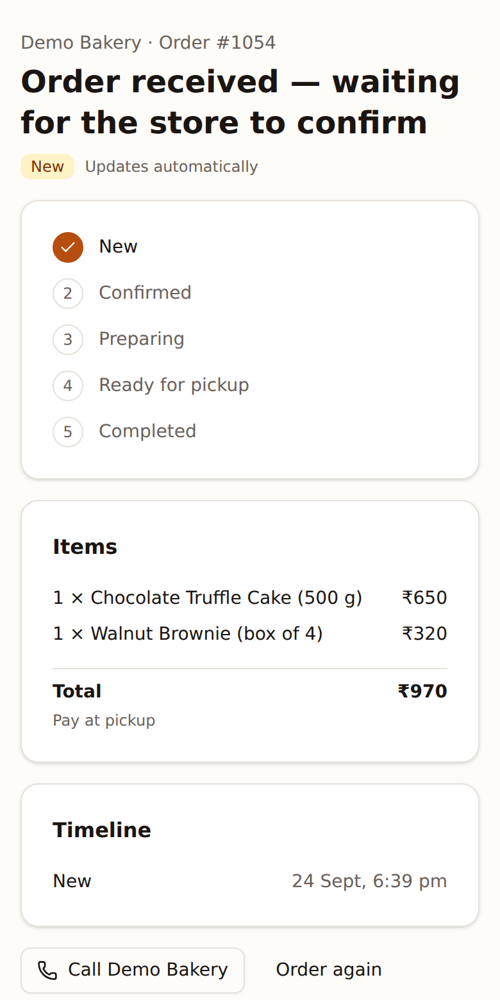
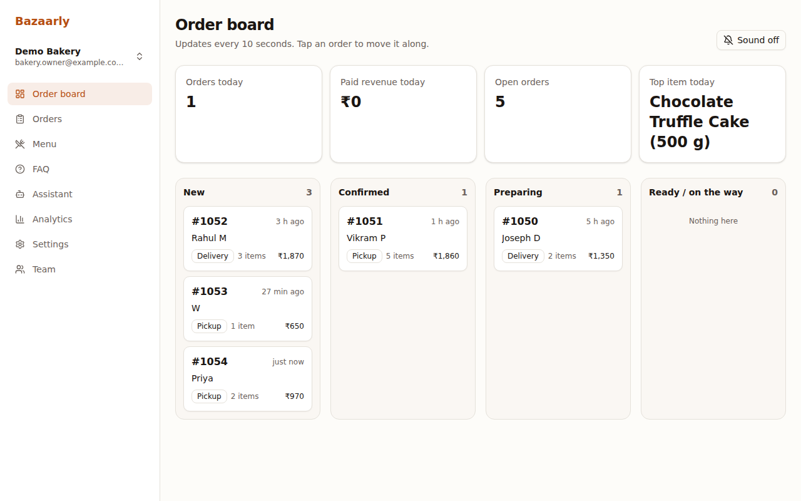
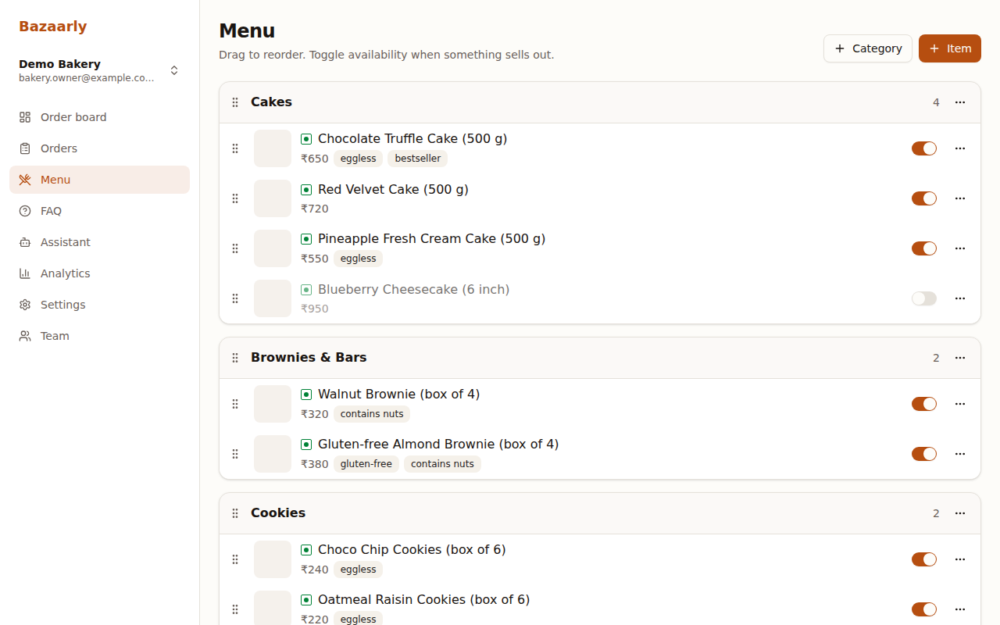
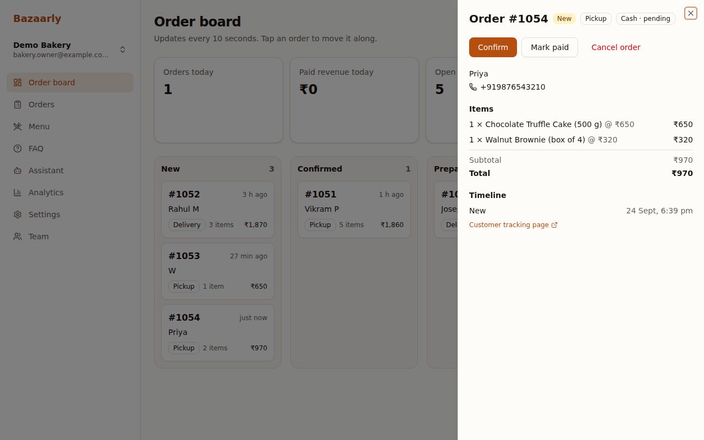
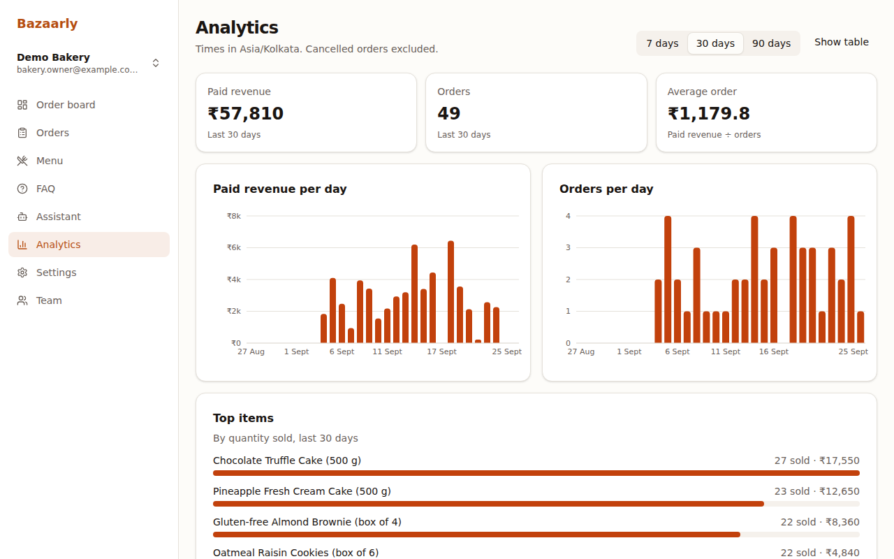
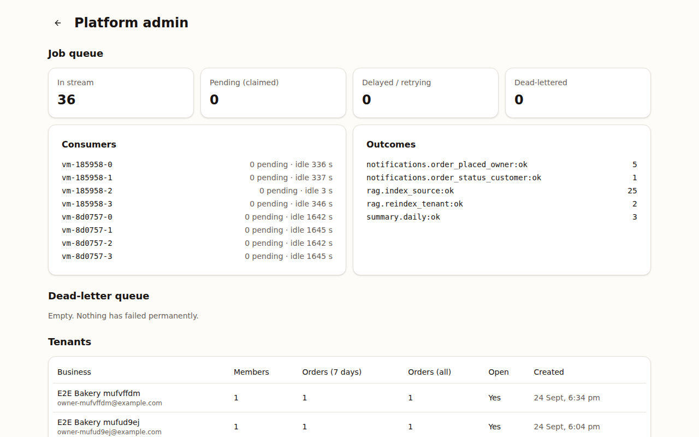
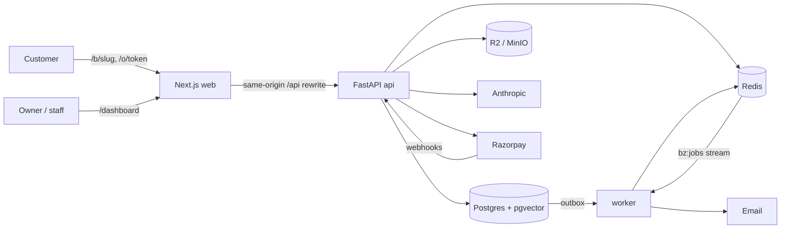

# Bazaarly

Online ordering for small local businesses — home bakeries, tiffin services, small studios and
craft shops. Each business gets a storefront customers open from a WhatsApp or Instagram link,
an owner dashboard, online payments or cash on delivery, email notifications, and an AI
assistant that answers customer questions using **only that business's own data**.

Multi-tenant, built phase by phase from [`docs/SPEC.md`](docs/SPEC.md). The interesting
engineering (hand-built job queue, payment idempotency, tenant isolation, grounded RAG) is
written up in [Design decisions](#design-decisions).

<p>
  
  
  
  
</p>



## Features

**For customers** (no account needed)
- Mobile-first storefront at `/b/{slug}`: categories, veg/non-veg markers, tags, cart saved on
  the device.
- Checkout with pickup or delivery (area checks, delivery fee, minimum order), cash on
  delivery or Razorpay online payment. Resubmitting never creates a duplicate order.
- Live tracking page `/o/{token}` with a timeline; email updates if they leave an email.
- Chat assistant that answers from the store's menu, FAQ and details, cites what it used, and
  says "please contact the business" instead of guessing.

**For owners and staff**
- Live order board (refreshes every 10 s, toast + optional sound for new orders), order search
  and filters, order detail with only the actions the state machine allows.
- Menu management with drag-to-reorder, availability toggles and photo uploads; FAQ editor.
- Analytics: daily paid revenue and orders, top items, in the business's timezone.
- Team invites by link, owner/staff roles, business settings and logo.
- Assistant log with an "unanswered" filter and one-click "turn into FAQ".
- Daily summary email at 9 pm local time.

**For the platform admin** — `/admin`: tenants, job-queue health, dead-letter retry/delete.

| | |
|---|---|
|  |  |
|  |  |

## Stack

| Layer | Tech |
|---|---|
| Web | Next.js 16 (App Router) · TypeScript · Tailwind v4 · shadcn/ui · TanStack Query · Recharts |
| API | Python 3.12 · FastAPI · SQLAlchemy 2 (async) · Alembic · Pydantic v2 · structlog |
| Data | PostgreSQL 16 + pgvector · Redis 7 (cache, rate limits, job queue) · S3 (R2 / MinIO) |
| AI | Anthropic API (`claude-haiku-4-5` by default) · fastembed `bge-small-en-v1.5` |
| Payments / email | Razorpay (httpx, no SDK) · Resend / SMTP |
| Quality | pytest (430+ tests on real Postgres + Redis) · Playwright · ruff · mypy --strict · ESLint |
| Infra | Docker Compose · GitHub Actions · Vercel + Railway |

## Architecture



`api` and `worker` share one Python codebase. Layering is routers → services → repositories →
models, and only repositories build queries — every tenant-owned query takes a `TenantContext`.
More detail, including the queue and payment sequence diagrams:
[`docs/architecture.md`](docs/architecture.md).

## Design decisions

The full log is [`docs/DECISIONS.md`](docs/DECISIONS.md). The ones worth talking about:

1. **Transactional outbox + hand-built Redis Streams queue.** Jobs are written to an `outbox`
   table in the same transaction as the change, so a job exists iff the change committed. A
   relay publishes rows with `FOR UPDATE SKIP LOCKED`; consumers use a consumer group, dedupe on
   an idempotency key (`bz:done:*`, 7 days), retry with full-jitter exponential backoff, and
   dead-letter after `max_attempts`. Retry/dead-letter moves are Lua scripts together with the
   `XACK`. Crashed deliveries come back through `XAUTOCLAIM` and count as an attempt. Why not
   Celery: D-018.
2. **Payment idempotency.** The browser's checkout callback and Razorpay's webhook both call
   `mark_paid`, a conditional `UPDATE payments … WHERE status <> 'paid' RETURNING …`; only the
   winner moves the order and enqueues emails. A concurrency test fires both paths (twice each)
   at once and asserts one transition and one notification. Expiry asks Razorpay before
   cancelling, so a late webhook never cancels a paid order.
3. **Tenant isolation.** Repositories always filter by tenant; another tenant's resource is a
   404, never a 403. `tests/integration/test_tenant_isolation.py` calls every tenant-scoped
   route as tenant A against tenant B's ids, and a meta-test enumerates the app's routes so a
   new route without an isolation case fails CI. RAG retrieval is tenant-filtered too, with its
   own leak test.
4. **Refresh-token rotation with reuse detection.** Opaque refresh tokens are stored hashed and
   rotated on every use; presenting a rotated token revokes the whole family.
5. **Grounded RAG with an eval harness.** The prompt treats customer text as data, answers
   only from retrieved context, returns structured JSON, and anything unparseable or
   unanswered becomes an exact fallback sentence. Two ~40-question datasets cover prices,
   allergens, availability, out-of-scope questions, prompt injection, Hinglish and
   cross-tenant probes.
6. **Order codes and pricing.** Per-tenant codes come from `UPDATE tenants SET order_seq = … RETURNING`
   inside the order transaction (20 concurrent orders → 20 unique codes, tested). Prices are
   recomputed on the server; the order schema doesn't even accept client prices.
7. **Deliberate trade-offs.** Polling (10 s board, 15 s tracking) instead of SSE,
   platform-level Razorpay keys (no merchant payouts yet), fixed-window rate limiting.

### Assistant eval results

| Tenant | Answerability | Must-include | Violations | Retrieval hit@6 |
|---|---|---|---|---|
| demo-bakery | _pending first run_ | | | |
| demo-tiffin | _pending first run_ | | | |

Running the evals needs an Anthropic API key and the real embedding model: see
[AI assistant](#ai-assistant) below. Reports land in `api/evals/reports/`.

## Quick start

Prerequisites: Docker, [uv](https://docs.astral.sh/uv/), Node 22 with pnpm.

```bash
git clone https://github.com/novvacode/SDD.git bazaarly && cd bazaarly
cp .env.example .env
make up install migrate seed
make dev          # api + worker + web
```

| URL | What |
|---|---|
| http://localhost:3000 | Web app |
| http://localhost:3000/b/demo-bakery | Demo storefront |
| http://localhost:8000/docs | API docs (OpenAPI) |
| http://localhost:8025 | Mailpit (local email inbox) |
| http://localhost:9001 | MinIO console (minioadmin / minioadmin) |

### Demo accounts (after `make seed`)

| Who | Email | Password |
|---|---|---|
| Platform admin | admin@example.com | admin-password-123 |
| Demo Bakery owner / staff | bakery.owner@example.com / bakery.staff@example.com | demo-password-123 |
| Demo Tiffin owner / staff | tiffin.owner@example.com / tiffin.staff@example.com | demo-password-123 |

The businesses, people and phone numbers are fictional.

### Commands

```bash
make help            # everything below and more
make test            # backend tests + web lint/typecheck
make lint / fmt      # ruff, mypy, eslint, prettier
make e2e             # Playwright against a running stack
make migration m="add foo"
make create-admin email=you@example.com
make eval t=demo-bakery
```

Backend tests need Postgres and Redis (`make up`). They use a separate `bazaarly_test`
database and Redis DB 15, so they never touch dev data.

## AI assistant

- Without keys: set `LLM_PROVIDER=fake` and `EMBEDDER=fake` in `.env` (deterministic stand-ins).
- Real answers: set `ANTHROPIC_API_KEY`, keep `EMBEDDER=fastembed` (the model downloads on first
  use and is baked into the API image). `LLM_MODEL` switches models.
- The worker keeps the knowledge base in sync as the menu, FAQ and settings change;
  "Rebuild knowledge" on `/dashboard/assistant` reindexes everything.
- Evals: `make eval t=demo-bakery` (real, costs a little) or
  `cd api && uv run python -m evals.run --tenant demo-bakery --fake` (harness check only).

## Online payments locally (optional)

Razorpay **test mode**: set `RAZORPAY_KEY_ID`, `RAZORPAY_KEY_SECRET` and
`RAZORPAY_WEBHOOK_SECRET`. Without them the storefront offers cash on delivery only. To receive
webhooks locally, tunnel the web app and point a test webhook (`payment.captured`,
`payment.failed`, `order.paid`) at it:

```bash
cloudflared tunnel --url http://localhost:3000
# webhook URL: https://<random>.trycloudflare.com/api/v1/webhooks/razorpay
```

## Deployment runbook

Target: **Vercel** (web) + **Railway** (api, worker, Postgres with pgvector, Redis),
Cloudflare R2 for images, Resend for email. Check current pricing before committing.

1. **Postgres + Redis on Railway.** Enable the `vector` and `citext` extensions (the first
   migration runs `CREATE EXTENSION IF NOT EXISTS` for both). If the plan lacks pgvector, use
   Neon. Redis must support Streams consumer groups (Railway Redis and Upstash do).
2. **API service** from `api/Dockerfile`, start command
   `alembic upgrade head && uvicorn app.main:app --host 0.0.0.0 --port $PORT --proxy-headers --forwarded-allow-ips='*'`,
   health check `GET /health`.
3. **Worker service** from the same image, start command `python -m app.queue.worker`
   (no HTTP health check). Scale replicas freely: the cron lock and consumer group handle it.
4. **Environment** for api and worker (see `.env.example`): `APP_ENV=production`,
   `APP_BASE_URL=https://<your-domain>`, `DATABASE_URL` (`postgresql+asyncpg://…`),
   `REDIS_URL`, a random 64-char `JWT_SECRET`, `S3_*` for R2 (`S3_REGION=auto`),
   `EMAIL_PROVIDER=resend` + `RESEND_API_KEY` + `EMAIL_FROM` on a verified domain,
   `RAZORPAY_*`, `ANTHROPIC_API_KEY`, optionally `SENTRY_DSN`. The API refuses to start in
   production if a required value is missing.
5. **Web on Vercel**, project root `web/`, env `API_INTERNAL_URL=https://<railway-api-url>`
   (used by the `/api` rewrite at build time), `NEXT_PUBLIC_IMAGE_BASE_URL` (the public R2 URL),
   optionally `NEXT_PUBLIC_SENTRY_DSN` / `SENTRY_DSN`. Add the custom domain here; the API is
   reached only through `https://<domain>/api/*`, so the refresh cookie stays first-party.
6. **First admin:** `railway run python -m scripts.create_admin --email you@example.com`
   (password from `ADMIN_PASSWORD` or a prompt).
7. **Razorpay webhook:** `https://<domain>/api/v1/webhooks/razorpay`, events
   `payment.captured`, `payment.failed`, `order.paid`, secret = `RAZORPAY_WEBHOOK_SECRET`.
   Place one test order with each payment method.
8. **Rollback:** redeploy the previous image on Railway / previous deployment on Vercel.
   Migrations are additive; if one must be undone, `alembic downgrade -1` from a one-off
   container *before* rolling the code back.

## Repository layout

```
api/     FastAPI app, worker, migrations, tests, evals, seed/admin scripts
web/     Next.js app and Playwright tests
docs/    SPEC, architecture, decisions, screenshots
infra/   container init scripts
```
