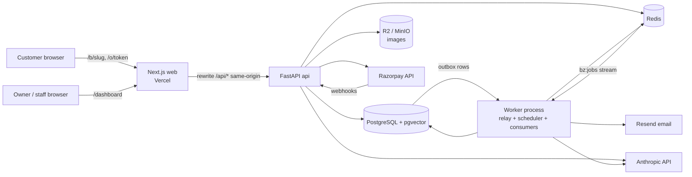
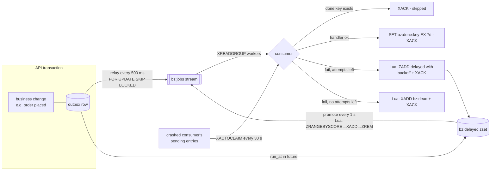

# Architecture

## System overview



- **Same-origin API.** `web/next.config.ts` rewrites `/api/:path*` to the FastAPI service. The
  refresh-token cookie is first-party and production needs no CORS.
- **One backend codebase, two processes.** `api` (uvicorn) and `worker`
  (`python -m app.queue.worker`) share `api/app/`.
- **Transactional outbox.** Side effects (email, re-embedding, webhook processing) are written to
  the `outbox` table in the same transaction as the business change; the worker relays them to
  Redis.
- **Money** is integer paise everywhere. **Time** is stored as UTC `timestamptz`.

## Backend layering

```
routers  →  services  →  repositories  →  models
(HTTP)      (business     (the only place     (SQLAlchemy
             rules, tx)    that builds SQL)    tables)
```

- Routers parse/validate input (Pydantic schemas) and call services. They never touch the DB
  session directly beyond passing it through.
- Services own transactions and business rules.
- Repositories take a `TenantContext` (or a resolved `tenant_id` for public routes) for every
  tenant-owned query.

## Request lifecycle

1. `RequestContextMiddleware` assigns `X-Request-ID`, binds it to the structlog context, adds
   security headers, and logs `method/route/status/duration_ms`.
2. Dependencies resolve auth (`get_current_user`) and tenant (`get_tenant_context`).
3. Errors raised as `AppError` are rendered as
   `{"error": {"code", "message", "details"}}` (SPEC §9).

## Job queue (hand-built on Redis Streams)



**Semantics.** At-least-once delivery. Every job carries an idempotency key; a successful run
stores `bz:done:{key}` for 7 days and later deliveries of the same key are acknowledged without
running. Handlers are written to be safe to repeat anyway.

**Why an outbox?** Enqueueing directly to Redis after a commit loses jobs when the process dies
between the commit and the enqueue; enqueueing before the commit creates jobs for changes that
roll back. The outbox row commits (or not) with the change itself, and the relay publishes it.
If the relay crashes after `XADD` but before marking rows published, the next run publishes
them again and the dedupe key absorbs the duplicates.

**Retries.** `delay = uniform(0, min(5 s · 2^attempt, 1 h))` (full jitter), then dead-letter
after `max_attempts` (per handler, default 5). Moving a job to the delayed set or the dead
stream is done in a Lua script together with the `XACK`, so a crash can't lose or duplicate it.

**Crash recovery.** Entries read but not acknowledged for 60 s are claimed with `XAUTOCLAIM`
and counted as an attempt; one that already used its last attempt is dead-lettered as
`WorkerCrashed` instead of looping forever.

**Cron.** Every 60 s the scheduler enqueues `summary.daily` for each tenant whose local time is
past 21:00, guarded by `SET bz:cron:summary.daily:{tenant}:{date} NX`, so replicas and restarts
never double-send.

**Shutdown.** On SIGTERM the worker stops reading, gives in-flight handlers up to 25 s, and
exits; anything unfinished is recovered by another worker through `XAUTOCLAIM`.

**Observability.** `GET /admin/jobs/stats` (stream length, `XPENDING`, delayed and dead
counts, consumers with idle times, `bz:stats` counters) and the dead-letter list with retry and
delete, all shown on `/admin`.
