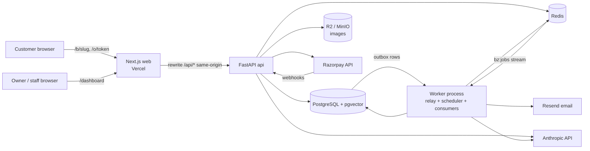

# Architecture

## System overview



- **Same-origin API.** `web/next.config.ts` rewrites `/api/:path*` to the FastAPI service. The
  refresh-token cookie is first-party and production needs no CORS.
- **One backend codebase, two processes.** `api` (uvicorn) and `worker`
  (`python -m app.queue.worker`) share `api/app/`.
- **Transactional outbox.** Side effects (email, re-embedding, webhook processing) are written to
  the `outbox` table in the same transaction as the business change; the worker relays them to
  Redis.
- **Money** is integer paise everywhere. **Time** is stored as UTC `timestamptz`.

## Backend layering

```
routers  →  services  →  repositories  →  models
(HTTP)      (business     (the only place     (SQLAlchemy
             rules, tx)    that builds SQL)    tables)
```

- Routers parse/validate input (Pydantic schemas) and call services. They never touch the DB
  session directly beyond passing it through.
- Services own transactions and business rules.
- Repositories take a `TenantContext` (or a resolved `tenant_id` for public routes) for every
  tenant-owned query.

## Request lifecycle

1. `RequestContextMiddleware` assigns `X-Request-ID`, binds it to the structlog context, adds
   security headers, and logs `method/route/status/duration_ms`.
2. Dependencies resolve auth (`get_current_user`) and tenant (`get_tenant_context`).
3. Errors raised as `AppError` are rendered as
   `{"error": {"code", "message", "details"}}` (SPEC §9).
